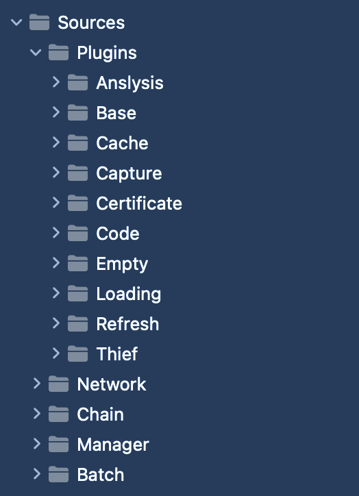

<p style="align: center">
<a href="https://github.com/yangKJ/KJNetworkPlugin">
</a>
<a href="https://github.com/yangKJ/KJNetworkPlugin">
</a>
<a href="https://cocoapods.org/pods/KJNetworkPlugin">
</a>
<a href="https://github.com/yangKJ/KJNetworkPlugin">
</a>
</p>

> + [**English Documents**](https://github.com/yangKJ/KJNetworkPlugin/blob/master/README_EN.md)

### 插件版网络请求架构，支持批量操作和链式操作
- 熟悉swift的朋友应该都知道一款优秀的三方库[Moya](https://github.com/Moya/Moya)，插件版网络请求是真香，于是乎借鉴思路制作一款纯oc版本的插件网络请求库。
- 熟悉oc的朋友又应该都知道一款优秀的三方库[YTKNetwork](https://github.com/yuantiku/YTKNetwork)，基于对象的协议版网络请求，然后他的批量网络请求和链式网络请求也超级香。
- 结合两者部分优点，制作一款纯OC版 批量 和 链式 插件版网络请求库。

### 功能清单
> + <font color=red>插件版网络请求可以更方便快捷的定制专属网络请求，并且支持批量操作，链式操作</font>

---



- 支持基本的网络请求，下载上传文件
- 支持配置通用请求跟路径，通用参数等
- 支持设置加载和提示框插件
- 支持解析结果插件
- 支持网络缓存插件
- 支持配置自建证书插件
- 支持修改请求体和获取响应结果插件
- 支持网络日志抓包插件
- 支持刷新加载更多插件
- 支持错误码解析插件
- 支持错误和空数据UI展示插件
- 支持批量操作
- 支持链式网络请求

---

### Network
<details open><summary><font size=2>**KJBaseNetworking**：网络请求基类，基于 AFNetworking 封装使用</font></summary>

> 这里也提供两个入口，设置通用的根路径和通用参数，类似：userID，token等

```
/// 根路径地址
@property (nonatomic, strong, class) NSString *baseURL;
/// 基本参数，类似：userID，token等
@property (nonatomic, strong, class) NSDictionary *baseParameters;
```
> 封装的有基本的网络请求，上传下载文件等方法
</details>

<details><summary><font size=2>**KJNetworkingRequest**：请求体，设置网络请求相关参数，其中包含参数，请求方式，插件等等</font></summary>
</details>

<details><summary><font size=2>**KJNetworkingResponse**：响应请求结果，获取插件之间产生的数据等等</font></summary>
</details>

<details><summary><font size=2>**KJNetworkingType**：汇总所有枚举和回调声明</font></summary>
</details>

<details><summary><font size=2>**KJNetworkBasePlugin**：插件基类，插件父类</font></summary>
</details>

<details><summary><font size=2>**KJNetworkPluginManager**：插件管理器，中枢神经</font></summary>

```
/// 插件版网络请求
/// @param request 请求体
/// @param success 成功回调
/// @param failure 失败回调
+ (void)HTTPPluginRequest:(KJNetworkingRequest *)request success:(KJNetworkPluginSuccess)success failure:(KJNetworkPluginFailure)failure;
```
</details>

<details><summary><font size=2>**KJNetworkingDelegate**：插件协议，管理网络请求结果</font></summary>

<font color=red>**目前抽离出5条协议方法，开始时刻、网络请求时刻、网络成功、网络失败、最终返回**</font>

```
/// 开始准备网络请求
/// @param request 请求相关数据
/// @param endRequest 是否结束下面的网络请求
/// @return 返回准备插件处理后的数据
- (KJNetworkingResponse *)prepareWithRequest:(KJNetworkingRequest *)request endRequest:(BOOL *)endRequest;

/// 网络请求开始时刻请求
/// @param request 请求相关数据
/// @param stopRequest 是否停止网络请求
/// @return 返回网络请求开始时刻插件处理后的数据
- (KJNetworkingResponse *)willSendWithRequest:(KJNetworkingRequest *)request stopRequest:(BOOL *)stopRequest;

/// 成功接收数据
/// @param request 请求相关数据
/// @param againRequest 是否需要再次请求该网络
/// @return 返回成功插件处理后的数据
- (KJNetworkingResponse *)succeedWithRequest:(KJNetworkingRequest *)request againRequest:(BOOL *)againRequest;

/// 失败处理
/// @param request 请求相关数据
/// @param againRequest 是否需要再次请求该网络
/// @return 返回失败插件处理后的数据
- (KJNetworkingResponse *)failureWithRequest:(KJNetworkingRequest *)request againRequest:(BOOL *)againRequest;

/// 准备返回给业务逻辑时刻调用
/// @param request 请求相关数据
/// @param error 错误信息
/// @return 返回最终加工之后的数据
- (KJNetworkingResponse *)processSuccessResponseWithRequest:(KJNetworkingRequest *)request error:(NSError **)error;
```
</details>

### Plugins插件集合
**目前已有9款插件供使用：**

- [**KJNetworkLoadingPlugin**](Docs/LOADING.md)：加载框和错误提示框插件
- [**KJNetworkAnslysisPlugin**](Docs/ANSLYSIS.md)：解析数据插件
- [**KJNetworkCachePlugin**](Docs/CACHE.md)：网络缓存插件
- [**KJNetworkCertificatePlugin**](Docs/CERTIFICATE.md)：配置自建证书插件
- [**KJNetworkThiefPlugin**](Docs/THIEF.md)：修改器插件
- [**KJNetworkCapturePlugin**](Docs/CAPTURE.md)：网络日志抓包插件
- [**KJNetworkCodePlugin**](Docs/CODE.md)：错误码解析插件
- [**KJNetworkRefreshPlugin**](Docs/REFRESH.md)：刷新加载更多插件
- [**KJNetworkEmptyPlugin**](Docs/EMPTY.md)：错误信息和空数据UI展示插件

### Chain链式插件网络
[**KJNetworkChainManager**](Docs/CHAIN.md)

### Batch批量插件网络
[**KJNetworkBatchManager**](Docs/BATCH.md)

### 关于作者
- 🎷 **邮箱地址：[ykj310@126.com](ykj310@126.com) 🎷**
- 🎸 **GitHub地址：[yangKJ](https://github.com/yangKJ) 🎸**
- 🎺 **掘金地址：[茶底世界之下](https://juejin.cn/user/1987535102554472/posts) 🎺**
- 🚴🏻 **简书地址：[77___](https://www.jianshu.com/u/c84c00476ab6) 🚴🏻**

#### 救救孩子吧，谢谢各位老板～～～～

-----
